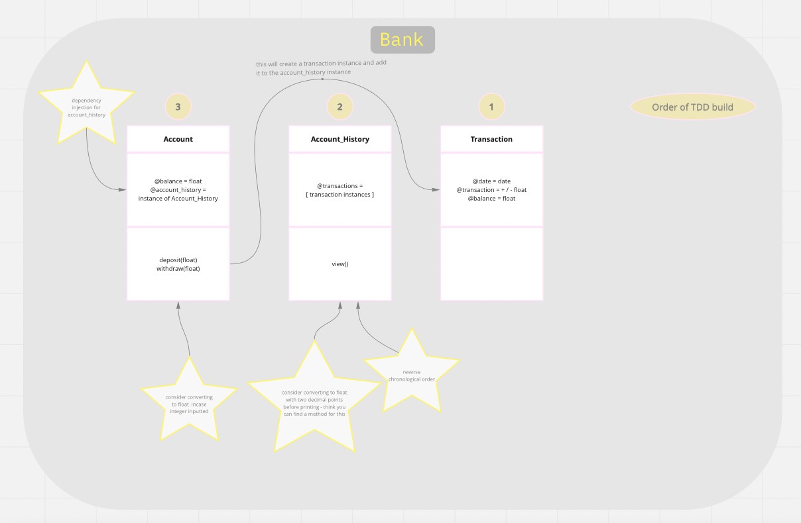

# Bank tech test

## Specification

### Requirements

* You should be able to interact with your code via a REPL like IRB or Node.  (You don't need to implement a command line interface that takes input from STDIN.)
* Deposits, withdrawal.
* Account statement (date, amount, balance) printing.
* Data can be kept in memory (it doesn't need to be stored to a database or anything).

### Acceptance criteria

**Given** a client makes a deposit of 1000 on 10-01-2023  
**And** a deposit of 2000 on 13-01-2023  
**And** a withdrawal of 500 on 14-01-2023  
**When** she prints her bank statement  
**Then** she would see

```
date || credit || debit || balance
14/01/2023 || || 500.00 || 2500.00
13/01/2023 || 2000.00 || || 3000.00
10/01/2023 || 1000.00 || || 1000.00
```

## Planning

## User Stories

As a client\
So that I can add money to my account\
I would like to be able to deposit a specified amount into my bank account

As a client\
So that I can spend money held in my account\
I would like to be able to withdraw a specified amount out of my bank account

As a client\
So that I can see my balance and recent transactions\
I would like to be able to view an account statement, in reverse chronological order

## Diagramming Class Interactions

