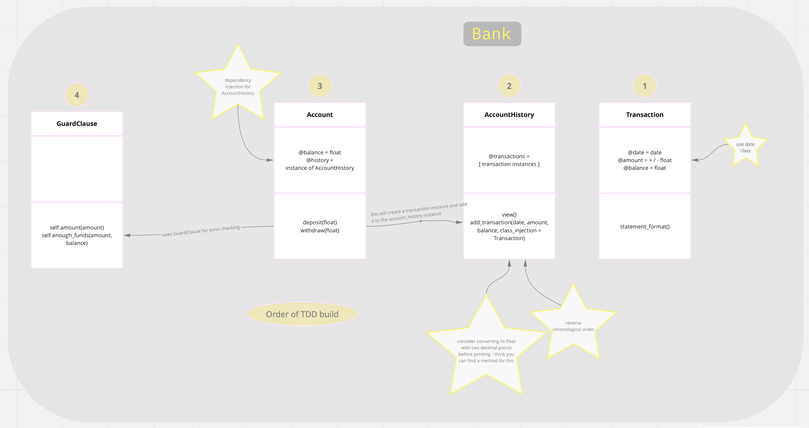

# Bank tech test

User can create a bank account, deposit and withdraw money, and view their statement using IRB.

## Getting Started

### Installation

1. Clone the repo
   ```sh
   git clone https://github.com/jessgordon/bank-tech-test
   ```
2. Install gems
   ```sh
   bundle install
   ```

### Usage

- Start IRB requiring account.rb
  ```sh
  irb -r ./lib/account.rb
  ```
- Create a new account
  ```sh
  new_account = Account.new
  ```
- Deposit money

  ```sh
  new_account.deposit(100.00)

  => 100.0
  ```

- Withdraw money

  ```sh
  new_account.withdraw(50.00)

   => 50.0
  ```

- View account statement

  ```sh
  new_account.history.view

  date || credit || debit || balance
  01/02/2022 || || 50.00 || 50.00
  01/02/2022 || 100.00 || || 100.00
  ```

### Testing

Tests are written using rspec, and can be found in the spec folder.

- Run all rspec tests
  ```sh
  rspec
  ```
- Run individual tests
  ```sh
  rspec spec/name_of_test_file.rb
  ```

## Specification

### Requirements

- You should be able to interact with your code via a REPL like IRB or Node. (You don't need to implement a command line interface that takes input from STDIN.)
- Deposits, withdrawal.
- Account statement (date, amount, balance) printing.
- Data can be kept in memory (it doesn't need to be stored to a database or anything).

### Acceptance criteria

**Given** a client makes a deposit of 1000 on 10-01-2023  
**And** a deposit of 2000 on 13-01-2023  
**And** a withdrawal of 500 on 14-01-2023  
**When** she prints her bank statement  
**Then** she would see

```
date || credit || debit || balance
14/01/2023 || || 500.00 || 2500.00
13/01/2023 || 2000.00 || || 3000.00
10/01/2023 || 1000.00 || || 1000.00
```

## Planning

### User Stories

As a client\
So that I can add money to my account\
I would like to be able to deposit a specified amount into my bank account

As a client\
So that I can spend money held in my account\
I would like to be able to withdraw a specified amount out of my bank account

As a client\
So that I can see my balance and recent transactions\
I would like to be able to view an account statement, in reverse chronological order

### Diagramming Class Interactions



## Improvements
- [ ] Consider using BigDecimal to improve arithmetic accuracy